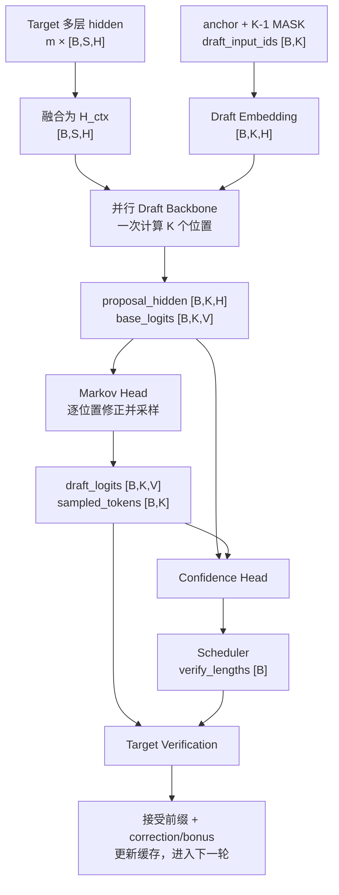

> 本文聚焦三件事：**内部到底怎样算、Tensor 怎样流动、什么时候有收益或负收益**。  
> 口径基于 DSpark 论文、DeepSeek-AI/DeepSpec 公开实现和 vLLM 当前 DSpark/Adaptive Verification 文档。

## 1. 先给出最重要的结论

DSpark 不是“一个小模型连续猜 7 次”，也不是“给普通投机解码加个阈值”。它由四个部分组成：

```text
① Target 中间层特征
          ↓
② 5 层左右的并行 Draft Backbone：一次 forward 得到 K 个位置的 base logits
          ↓
③ 轻量 Markov Head：根据前一个实际采样 token，串行修正每个位置的 logits
          ↓
④ Confidence Head + Scheduler：只把值得验证的连续前缀送给 Target
```

其中：

- **并行 Backbone**负责“看懂上下文”，计算量较重，但只运行一次；
- **Markov Head**负责“让第 `k` 个草稿知道第 `k-1` 个实际生成了什么”，必须串行，但很轻；
- **Confidence Head**估计每个位置被 Target 接受的概率；
- **Scheduler**结合当前 GPU 负载决定每条请求验证几个 token；
- **Target rejection sampling**决定最终接受结果，保证正确实现时输出分布不变。

一句话概括：

> **重计算并行做，token 依赖用小 Head 串行补，Target 验证预算按置信度和负载动态分配。**

---

## 2. DSpark 在一轮 Decode 中的位置

设当前已经生成：

```text
prompt + ... + x0
```

`x0` 是 Target 上一轮确认的最后一个 token，也叫 anchor/bonus token。

一轮 DSpark 的执行顺序是：

```text
1. Draft 输入：        [x0, MASK, MASK, ..., MASK]，长度 K
2. Draft Backbone：    一次 forward，得到 K 个 hidden state/base logits
3. Markov 采样：       从左到右生成草稿 x1...xK
4. Confidence：        得到 c1...cK
5. Scheduler：         选择连续前缀 x1...xℓ，ℓ ≤ K
6. Target Verify：     一次 forward 并行验证 x1...xℓ
7. Commit：            接受最长前缀，再产生 correction/bonus token
8. 下一轮：            以 Target 最终产生的 token 作为新 anchor
```

这里有两次“生成”：

- Draft 生成的是**候选 token**，可以被丢弃；
- Target verification 产生的接受前缀和 correction/bonus token 才真正写入输出。

---

### 2.1 融合 Target 多层信息

```
# m 个 Target 层
selected_hidden = [
    hidden_l1,                              # [B,S,H]
    ...
    hidden_lm,                              # [B,S,H]
]

target_features = concat(
    selected_hidden,
    dim=-1,
)                                           # [B,S,mH]

H_ctx = RMSNorm(
    target_features @ W_c
)                                           # [B,S,H]
```

含义：

```
[B,S,H]
= B 条请求
× 每条请求 S 个上下文 token
× 每个 token 一个 H 维表示
```

`H_ctx[b,s,:]` 是第 `b` 条请求、第 `s` 个上下文 token 融合 Target 多层信息后的向量。

---

### 2.2 构造 Draft 输入

```
anchor_ids                                  # [B]

draft_input_ids = [
    anchor,
    MASK,
    ...,
    MASK,
]                                           # [B,K]

draft_hidden = embedding(
    draft_input_ids
)                                           # [B,K,H]
```

含义：

```
[B,K,H]
= B 条请求
× 每条请求 K 个 Draft 位置
× 每个位置 H 个 hidden 特征
```

`draft_hidden[b,k,:]` 是第 `b` 条请求、第 `k` 个 Draft 位置的 hidden vector。

---

### 2.3 并行 Draft Backbone

Draft Query 来自 `K` 个 Draft 位置：

```
Q = q_proj(draft_hidden)                    # [B,N_q,K,d_h]
```

K/V 来自 Target 上下文和 Draft block：

```
K_ctx = k_proj(H_ctx)                       # [B,N_kv,S,d_h]
K_draft = k_proj(draft_hidden)              # [B,N_kv,K,d_h]

K_total = concat(
    [K_ctx, K_draft],
    dim=sequence,
)                                           # [B,N_kv,S+K,d_h]
```
==这一步解释了为什么 DSpark 比普通小模型 drafter 更贴近 Target：它直接使用 Target 已经计算出的多层语义特征。==

`V_total` 同理：

```
V_total                                     # [B,N_kv,S+K,d_h]
```

Attention：

```
attention_score = Q @ transpose(K_total)    # [B,N_q,K,S+K]

draft_hidden = attention(
    Q,
    K_total,
    V_total,
)                                           # [B,K,H]
```

经过所有 Draft 层：

```
proposal_hidden                             # [B,K,H]
```

经过 LM Head：

```
base_logits = LM_head(
    proposal_hidden
)                                           # [B,K,V]
```

含义：

```
[B,K,V]
= B 条请求
× 每条请求 K 个 Draft 位置
× 每个位置 V 个候选 token 分数
```

因此：

```
base_logits[b, k, :]                        # [V]
```

是第 `b` 条请求、第 `k` 个位置对整个词表 `V` 个 token 的评分。

---

### 2.4 Markov Head 修正并采样

`base_logits [B,K,V]` 会沿 `K` 维逐位置取出。`x_k [B]` 表示每条请求各采样出一个 token ID。

```
prev = anchor_ids                           # [B]

corrected_logits = []
sampled_tokens = []

for k in range(K):
    # ① 取出第 k 个位置
    base_k = base_logits[:, k, :]            # [B,V]

    # [B,V] =
    # B 条请求，每条请求有 V 个候选 token 分数


    # ② 每条请求用自己的前一个 token 生成偏置
    prev_embed = W1(prev)                    # [B,r]
    markov_bias = W2(prev_embed)             # [B,V]

    # markov_bias[b,:] =
    # 第 b 条请求根据前一个 token 得到的 V 个加减分


    # ③ 修正 V 个候选的分数
    step_logits = base_k + markov_bias       # [B,V]


    # ④ 每条请求从自己的 V 个候选中采样一个 token
    x_k = sample(step_logits)                # [B]

    # x_k[b] =
    # 第 b 条请求在位置 k 采样出的一个 token ID


    # ⑤ 保存当前结果
    corrected_logits.append(
        step_logits.unsqueeze(1)             # [B,1,V]
    )

    sampled_tokens.append(
        x_k.unsqueeze(1)                     # [B,1]
    )


    # ⑥ 当前 token 成为下一位置的前驱
    prev = x_k                               # [B]
```

最后把 `K` 步重新拼起来：

```
draft_logits = concat(
    corrected_logits,
    dim=1,
)                                           # [B,K,V]

sampled_tokens = concat(
    sampled_tokens,
    dim=1,
)                                           # [B,K]
```

含义：

```
draft_logits[b,k,:]   第 b 条请求、第 k 个位置最终的 V 个分数
sampled_tokens[b,k]   从这 V 个候选中采出的一个 token ID
```

---

### 2.5 Confidence Head

构造每个位置的前驱 token：

```
prev_token_ids = concat(
    [
        anchor_ids[:, None],                # [B,1]
        sampled_tokens[:, :-1],             # [B,K-1]
    ],
    dim=1,
)                                           # [B,K]
```

查 Markov Embedding：

```
prev_embeddings = W1(
    prev_token_ids
)                                           # [B,K,r]
```

与 Backbone hidden 拼接：

```
confidence_features = concat(
    [
        proposal_hidden,                    # [B,K,H]
        prev_embeddings,                    # [B,K,r]
    ],
    dim=-1,
)                                           # [B,K,H+r]

confidence = sigmoid(
    confidence_head(confidence_features)
)                                           # [B,K]
```

含义：

```
confidence[b,k]
```

是第 `b` 条请求、第 `k` 个 Draft token 的条件接受概率。每个位置只有一个概率，所以没有 `V` 维。


累计前缀生存率
$$
a_k=\prod_{i=1}^{k}c_i：
$$

```
prefix_survival = confidence.cumprod(
    dim=1,
)                                           # [B,K]
```

---
### 2.6 Scheduler 选择要验证的 Draft 前缀

输入是每个 Draft 位置的前缀生存概率：

```
prefix_survival                           # [B,K]

# prefix_survival[b,k] =
# 第 b 条请求的前 k+1 个 Draft token
# 能够全部通过 Target 验证的估计概率
```

Scheduler 根据置信度和硬件负载，为每条请求选择验证长度：

```
# ① 为每条请求选择需要验证的 Draft token 数量
verify_lengths = scheduler(
    prefix_survival,
    hardware_profile,
)                                           # [B]

# verify_lengths[b] = ell_b
# 表示第 b 条请求验证前 ell_b 个 Draft token
#
# 每个 ell_b 都是整数，并且：
# 0 <= ell_b <= K
```

由于每条请求的 `ell_b` 可能不同，后续按单条请求处理：

```
verify_inputs = []
kept_draft_probs = []

for b in range(B):
    # -------------------------------------------------
    # ② 取出第 b 条请求的验证长度
    # -------------------------------------------------

    ell_b = verify_lengths[b]                # 标量

    # ell_b =
    # 第 b 条请求需要送给 Target 验证的 Draft token 数


    # -------------------------------------------------
    # ③ 保留这条请求的前 ell_b 个 Draft token
    # -------------------------------------------------

    kept_tokens_b = sampled_tokens[
        b,
        :ell_b,
    ]                                       # [ell_b]

    # kept_tokens_b[k] =
    # 第 b 条请求保留的第 k 个 Draft token ID


    # -------------------------------------------------
    # ④ 保留这些位置对应的最终 Draft logits
    # -------------------------------------------------

    kept_logits_b = draft_logits[
        b,
        :ell_b,
        :,
    ]                                       # [ell_b,V]

    # [ell_b,V] =
    # ell_b 个保留位置
    # 每个位置有 V 个候选 token 的分数
    #
    # kept_logits_b[k,:] =
    # 第 k 个保留位置对整个词表 V 个 token 的评分


    # -------------------------------------------------
    # ⑤ 把每个位置的 V 个分数转换成概率
    # -------------------------------------------------

    kept_probs_b = softmax(
        kept_logits_b,
        dim=-1,
    )                                       # [ell_b,V]

    # dim=-1 表示：
    # 对每一行的 V 个候选单独做 softmax
    #
    # kept_probs_b[k,:] =
    # 第 k 个 Draft 位置的 V 个候选 token 概率
    #
    # sum(kept_probs_b[k,:]) = 1


    # -------------------------------------------------
    # ⑥ 构造 Target 验证输入
    # -------------------------------------------------

    verify_input_b = concat(
        [
            anchor_ids[b:b+1],              # [1]
            kept_tokens_b,                  # [ell_b]
        ],
        dim=0,
    )                                       # [1+ell_b]

    # verify_input_b =
    # [anchor_b, x_1, x_2, ..., x_ell_b]
    #
    # anchor 必须放在最前面：
    # Target 在 anchor 位置输出的 logits 用于预测 x_1


    # -------------------------------------------------
    # ⑦ 保存这条请求的验证输入和 Draft 概率
    # -------------------------------------------------

    verify_inputs.append(verify_input_b)     # 每项 [1+ell_b]
    kept_draft_probs.append(kept_probs_b)    # 每项 [ell_b,V]
```

因为 `ell_b` 不同，这些 Tensor 是变长的：

```
第 1 条请求：[1+ell_1]
第 2 条请求：[1+ell_2]
...
第 B 条请求：[1+ell_B]
```

生产系统通常将它们打包：

```
M = verify_lengths.sum()                    # 标量

verify_input_ids_flat = pack(
    verify_inputs
)                                           # [B+M]

draft_probs_flat = concat(
    kept_draft_probs,
    dim=0,
)                                           # [M,V]

# M = 所有请求保留的 Draft token 总数
#
# [B+M] =
# B 个 anchor
# + M 个需要验证的 Draft token
#
# [M,V] =
# M 个 Draft 位置
# × 每个位置 V 个候选 token 概率
```

---

### 2.7 Target 验证 Draft token

==总的来说，Target 使用历史 KV Cache，并将 `[anchor, x₁, …, x_ℓ]` 作为本轮输入，一次 forward 得到 `[1+ℓ,V]`；但 logits 是错位预测的：anchor 位置预测 `x₁`，`x₁` 位置预测 `x₂`，依此类推，最后一行用于生成 bonus token。随后将 Target 给每个 Draft token 的概率与 Draft 自己的概率比较，通过 rejection sampling 决定最长接受前缀。==

下面继续按单条请求 `b` 讲解。

```
for b in range(B):
    verify_input_b = verify_inputs[b]        # [1+ell_b]
    draft_probs_b = kept_draft_probs[b]      # [ell_b,V]
```

#### 2.7.1 Target 一次 forward

```
    # -------------------------------------------------
    # ① Target 一次处理 anchor 和 ell_b 个 Draft token
    # -------------------------------------------------

    target_output_b = target_model(
        input_ids=verify_input_b,
        past_key_values=target_kv_cache[b],
    )

    target_logits_b = target_output_b.logits # [1+ell_b,V]

    # [1+ell_b,V] =
    # 1 个 anchor + ell_b 个 Draft 输入位置
    # 每个位置输出 V 个候选 token 分数
```

位置与预测目标的对应关系：

```
target_logits_b[0,:]       根据 anchor 预测 x_1
target_logits_b[1,:]       根据 anchor,x_1 预测 x_2
...
target_logits_b[ell_b-1,:] 预测 x_ell_b
target_logits_b[ell_b,:]   预测 Draft block 后面的 bonus token
```

转换为概率：

```
    # -------------------------------------------------
    # ② 把每个位置的 V 个 Target 分数转换成概率
    # -------------------------------------------------

    target_probs_b = softmax(
        target_logits_b,
        dim=-1,
    )                                       # [1+ell_b,V]

    # target_probs_b[k,:] =
    # Target 在位置 k 对整个词表 V 个 token 的概率分布
    #
    # 每一行的 V 个概率之和为 1
```

取前 `ell_b` 行来验证 Draft token：

```
    # -------------------------------------------------
    # ③ 取出用于检查 Draft token 的 Target 分布
    # -------------------------------------------------

    target_verify_probs_b = target_probs_b[
        :ell_b,
        :,
    ]                                       # [ell_b,V]

    # 最后一行 target_probs_b[ell_b,:] 暂时不参与验证
    # 它只在所有 Draft token 都接受时用于生成 bonus token
```

现在两个模型的分布完全对齐：

```
target_verify_probs_b：[ell_b,V]
draft_probs_b：       [ell_b,V]
kept_tokens_b：       [ell_b]
```

#### 2.7.2 取出已提议 token 的概率

```
    proposed_tokens_b = kept_tokens_b        # [ell_b]

    # proposed_tokens_b[k] =
    # Draft 在第 k 个位置实际采出的 token ID
```

从 Target 分布中取出对应 token 的概率：

```
    # -------------------------------------------------
    # ④ Target 给已提议 token 的概率
    # -------------------------------------------------

    selected_target_prob_b = gather(
        target_verify_probs_b,              # [ell_b,V]
        proposed_tokens_b,                  # [ell_b]
    )                                       # [ell_b]

    # 对每个位置 k：
    #
    # token_id = proposed_tokens_b[k]
    # selected_target_prob_b[k]
    #     = target_verify_probs_b[k,token_id]
    #
    # 即 Target 给 Draft 实际提议 token 的概率
```

从 Draft 分布中取出同一个 token 的概率：

```
    # -------------------------------------------------
    # ⑤ Draft 给自己已提议 token 的概率
    # -------------------------------------------------

    selected_draft_prob_b = gather(
        draft_probs_b,                      # [ell_b,V]
        proposed_tokens_b,                  # [ell_b]
    )                                       # [ell_b]

    # selected_draft_prob_b[k]
    #     = draft_probs_b[k,proposed_tokens_b[k]]
    #
    # 即 Draft 当初采样这个 token 时给它的概率
```

---

### 2.8 Rejection Sampling

#### 2.8.1 计算每个 Draft token 的接受概率

```
    # -------------------------------------------------
    # ① 比较 Target 概率和 Draft 概率
    # -------------------------------------------------

    accept_prob_b = minimum(
        1,
        selected_target_prob_b
        / selected_draft_prob_b,
    )                                       # [ell_b]

    # accept_prob_b[k] =
    # 第 k 个 Draft token 被接受的概率
    #
    # 每个位置只需要一个接受概率，因此 shape 是 [ell_b]
```

生成随机数：

```
    # -------------------------------------------------
    # ② 为每个 Draft token 生成一个随机数
    # -------------------------------------------------

    random_b = rand(
        shape=(ell_b,)
    )                                       # [ell_b]

    accept_mask_b = (
        random_b < accept_prob_b
    )                                       # [ell_b]

    # accept_mask_b[k] = True：
    # 第 k 个 token 单独通过随机接受测试
```

#### 2.8.2 只保留连续接受前缀

```
    # -------------------------------------------------
    # ③ 第一次拒绝后，丢弃所有后续 token
    # -------------------------------------------------

    accept_prefix_b = cumprod(
        accept_mask_b,
        dim=0,
    )                                       # [ell_b]

    # 例如：
    # accept_mask_b   = [1,1,0,1]
    # accept_prefix_b = [1,1,0,0]
    #
    # 第三个 token 拒绝后，第四个也不能提交


    # -------------------------------------------------
    # ④ 统计连续接受的 Draft token 数
    # -------------------------------------------------

    accepted_count_b = sum(
        accept_prefix_b
    )                                       # 标量

    # accepted_count_b = a_b
    #
    # 表示第 b 条请求真正接受了前 a_b 个 Draft token
```

---

### 2.9 生成 correction 或 bonus token

```
    a_b = accepted_count_b                  # 标量
```

#### 2.9.1 中途发生拒绝

```
    if a_b < ell_b:
        # ---------------------------------------------
        # ① 找到第一个被拒绝位置的完整概率分布
        # ---------------------------------------------

        target_dist = target_verify_probs_b[
            a_b,
            :,
        ]                                   # [V]

        draft_dist = draft_probs_b[
            a_b,
            :,
        ]                                   # [V]

        # [V] =
        # 被拒绝位置对整个词表 V 个 token 的概率


        # ---------------------------------------------
        # ② 构造残差分布
        # ---------------------------------------------

        residual = clamp(
            target_dist - draft_dist,
            min=0,
        )                                   # [V]

        residual = residual / residual.sum()# [V]

        # residual[v] =
        # correction token 取词表中第 v 个 token 的概率


        # ---------------------------------------------
        # ③ 从残差分布采样 correction token
        # ---------------------------------------------

        next_token_b = sample(
            residual
        )                                   # 标量

        # next_token_b =
        # Target 用来替换第一个被拒绝 Draft token 的 token ID


        # ---------------------------------------------
        # ④ 提交接受前缀和 correction token
        # ---------------------------------------------

        committed_tokens_b = concat(
            [
                proposed_tokens_b[:a_b],    # [a_b]
                next_token_b.unsqueeze(0),  # [1]
            ],
            dim=0,
        )                                   # [a_b+1]
```

#### 2.9.2 全部 Draft token 都接受

```
    else:
        # ---------------------------------------------
        # ① 使用 Target 最后一行概率生成 bonus token
        # ---------------------------------------------

        bonus_dist = target_probs_b[
            -1,
            :,
        ]                                   # [V]

        # bonus_dist =
        # Target 在所有 Draft token 之后预测的 V 个 token 概率


        # ---------------------------------------------
        # ② 采样 bonus token
        # ---------------------------------------------

        next_token_b = sample(
            bonus_dist
        )                                   # 标量


        # ---------------------------------------------
        # ③ 提交全部 Draft token 和 bonus token
        # ---------------------------------------------

        committed_tokens_b = concat(
            [
                proposed_tokens_b,          # [ell_b]
                next_token_b.unsqueeze(0),  # [1]
            ],
            dim=0,
        )                                   # [ell_b+1]
```

无论哪个分支：

```
commit_length_b = a_b + 1                   # 标量

# 本轮新增：
# a_b 个被接受的 Draft token
# + 1 个 Target 产生的 correction/bonus token
```

---

### 2.10 更新缓存并进入下一轮

```
# -------------------------------------------------
# ① 把真正提交的 token 追加到输出
# -------------------------------------------------

output_ids_b = concat(
    [
        output_ids_b,
        committed_tokens_b,
    ],
    dim=0,
)
```

只保留 Target verification 中真正有效的 hidden states：

```
# -------------------------------------------------
# ② 保留 anchor 和已接受 Draft token 的 Target hidden
# -------------------------------------------------

new_target_hidden_b = target_output_b.hidden[
    :a_b + 1,
    :,
]                                           # [a_b+1,H]

# [a_b+1,H] =
# anchor + a_b 个已接受位置
# 每个位置一个 H 维 Target hidden vector
#
# 被拒绝的 Draft 后缀不会写入缓存
```

更新上下文长度：

```
# -------------------------------------------------
# ③ 将有效位置写入 KV Cache
# -------------------------------------------------

S_b = S_b + a_b + 1                         # 标量

# 新增进入缓存的位置：
# anchor + a_b 个已接受 Draft token
```

把 Target 新生成的 token 作为下一轮 anchor：

```
# -------------------------------------------------
# ④ correction/bonus 成为下一轮 anchor
# -------------------------------------------------

next_anchor_ids[b] = next_token_b            # 标量
```

下一轮重新构造：

```
draft_input_ids[b, 0] = next_anchor_ids[b]
draft_input_ids[b, 1:] = MASK

# [anchor, MASK, ..., MASK]
# shape 仍然是 [K]
```

注意：Bonus token 是：**当所有 Draft token 都被接受时，利用 Target 最后一行 logits 额外生成的一个 token。**

例如 Draft 提出：

```
anchor：D
Draft： E, F, G
```

Target 输入：

```
[D, E, F, G]
```

对应输出：

```
D 位置的 logits → 验证 E
E 位置的 logits → 验证 F
F 位置的 logits → 验证 G
G 位置的 logits → 预测下一个 token H
```

如果 `E、F、G` 全部接受：

```
本轮提交：E, F, G, H
```

其中 `H` 就是 bonus token。

它有三个作用：

- 利用 Target 已经算出的最后一行 logits，不需要额外 forward；
- 让本轮在接受 `ℓ` 个 Draft token 后还能多前进一个 token；
- 作为下一轮的 anchor。

如果中途发生拒绝，就不生成 bonus，而是生成 correction token：

```
全部接受：接受前缀 + bonus
中途拒绝：接受前缀 + correction
```

==因此无论哪种情况，Target 都会保证本轮额外产生一个可信 token。==

---

## 3. 优点

==以前的并行 drafter 虽然快，但没有 token 间依赖，越靠后的 token 越容易被拒绝；固定验证长度还会浪费 Target 算力。DSpark 用“并行 Backbone + 轻量串行 Markov Head”提高草稿连贯性，再用置信度调度只验证值得验证的前缀。==

### 3.1 比自回归 Drafter 更适合长 Block

重的 Draft Transformer 每轮只 forward 一次，不需要像自回归 drafter 那样新增 `K` 次串行 Transformer forward。在短 block、GPU 并行度充足时，其 wall-clock 对 `K` 不那么敏感；但总 FLOPs、LM Head 和 softmax 开销仍会随 `K` 增加。串行部分主要是低秩 Head、softmax 和 sampling。

### 3.2 比纯并行 Drafter 的后缀更连贯

Markov/RNN Head 看到了实际采样前驱，能减少 `of problem` 这类跨模式拼接。论文中 DSpark 相比 DFlash 的优势会随 block 增长而扩大。

### 3.3 能同时优化延迟与在线吞吐

固定长 block 适合轻载，却可能伤害高并发。Adaptive verification 在轻载时多验、重载时少验，使同一配置覆盖更宽的负载范围。

### 3.4 正确实现时不改变 Target 输出分布

Draft 只提出候选，Target rejection sampling 仍是最终裁判。它属于推理加速，而不是模型质量近似或蒸馏替代。

### 3.5 可以复用 Target 语义特征

多层 hidden-state injection 让较小 Draft 不必从 token ids 独立重建全部上下文理解。

---

## 4. 缺点与工程代价

### 4.1 多一套模型权重和 KV Cache

DSpark 需要 Draft Backbone、Markov Head、Confidence Head，以及 Draft 自己的 KV Cache。即使小于 Target，也会占用显存并增加部署复杂度。

### 4.2 每轮仍固定生成完整 Draft Block

Scheduler 可以少验证，却不能收回已经执行的 Draft Backbone 成本。对高熵、低接受率请求，生成完整 block 后只保留 0～1 个 token 可能是净亏损。

### 4.3 词表投影并不免费

每个位置都要从 `[H]` 投影到 `[V]`，Markov Head 也要从 `[r]` 投影到 `[V]`。对于 `V≈15 万` 的模型，LM Head、Markov projection、softmax 的开销不可忽略。

### 4.4 必须同时维护两套增量状态

Target 接受几个 token 后，Draft 的增量状态必须重新与已提交前缀对齐。实现上可以只保留接受前缀，也可以像公开 evaluator 那样裁掉整块 proposal、再用 Target 已确认位置的 hidden states 更新 Draft；无论哪种方式，被拒绝的后缀都不能残留。Cache 对齐错误会直接导致后续分布错误。

### 4.5 Confidence 失准会让 Scheduler 做错选择

若 confidence 过度自信：

```text
会验证太多低价值 token → 高并发吞吐下降
```

若过度保守：

```text
会过早截断 → 浪费本可获得的 accepted tokens
```

所以不能只看 AUROC/排序，还要看 ECE、reliability curve 和真实吞吐。

### 4.6 Serving Engine 约束多

动态 ragged verification、CUDA Graph cost profile、跨请求全局排序、TP/PP/LoRA/logprobs 兼容性，都需要底层引擎配合。论文算法容易讲，生产实现不轻。

### 4.7 只优化 Decode

DSpark 不会减少长 prompt 的 Prefill 延迟。若请求主要时间花在 Prefill，端到端收益会被稀释。

---

## 5. 资料来源

- [DSpark 原论文](https://arxiv.org/abs/2607.05147)
- [DeepSeek-AI / DeepSpec 官方仓库](https://github.com/deepseek-ai/DeepSpec)
- [Qwen3-4B DSpark checkpoint 配置](https://huggingface.co/deepseek-ai/dspark_qwen3_4b_block7/blob/main/config.json)
- [DeepSpec Markov Head 实现](https://github.com/deepseek-ai/DeepSpec/blob/main/deepspec/modeling/dspark/markov_head.py)
- [DeepSpec proposal 构建与静态 confidence 截断](https://github.com/deepseek-ai/DeepSpec/blob/main/deepspec/eval/dspark/draft_ops.py)
- [DeepSpec rejection sampling 实现](https://github.com/deepseek-ai/DeepSpec/blob/main/deepspec/eval/base_evaluator.py)
- [vLLM Adaptive Verification 使用与限制](https://docs.vllm.ai/en/latest/features/speculative_decoding/adaptive_verification/)

> 说明：论文线上结果来自特定 DeepSeek-V4 preview 服务系统；公开 DeepSpec evaluator 与生产调度器的能力边界不同。部署前应以自己使用的推理框架版本、checkpoint、硬件和真实流量重新验证。
